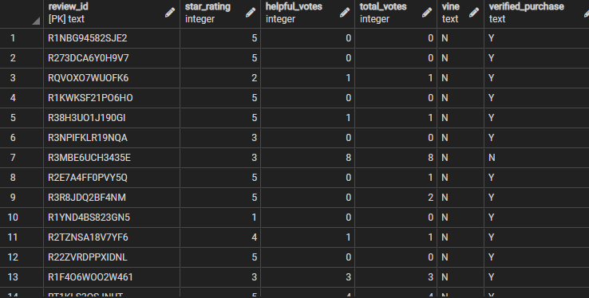
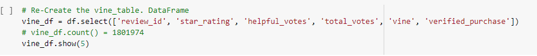
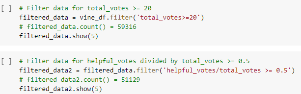
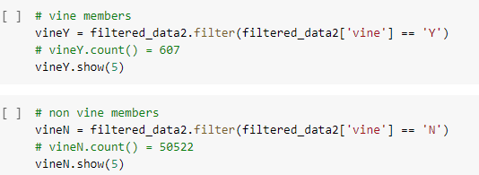
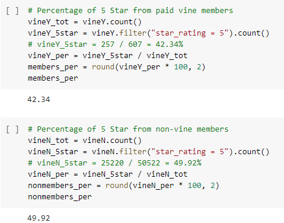

# Amazon Vine Analysis
Module 16

## Overview of the project:
The purpose of this project was to analyze Amazon reviews written by paid members of the Vine program and compare them to reviews written by non-members. This will let us know if the program introduces a bias in the number of five stars awarded.

## Results:
•	For this project we used `Spark` and `Google Colaboratory` to analyze camera data from `Amazon S3 cloud storage`. We generated four new `DataFrames` from the main one using the `df.select`, `groupby`, `agg` and `withColumnRenamed` functions to get specific columns matching our `Postgres SQL` tables. We then sent the data to Postgres SQL.

•	For further analysis of the Vine table, we first recreated the table with the `select` function in `CoLab`.

•	Next, we filtered the data to include only those with at least twenty total votes then filtered for a ratio of `helpful votes/total votes` greater or equal to 50%

•	In the following step, we separated members from non-members using the same `filter` function. We obtained 607 vine member reviews and 50522 non-member reviews.

•	Finally, we calculated the numbers of five stars reviews and obtained 257 for members and 25220 for non-members. This number and the totals were used to calculate the percentage of five stars awarded by members versus non-member and rounded with two decimals. Members gave five-star reviews 42.34% of the time, while for non-members it was 49.92%

## Summary:
•	Based on our analysis, we see that non-member are giving five-star reviews more often than members of the Vine program. This could be that non-members pay less attention to their reviews, while members may try the product longer and give a more accurate review. Therefore, the Vine program does not seem to introduce a positive bias, but we do not know if there is a negative bias. For sellers, it would not be attractive to pay the Vine review fee since if their products would have a lower star count. We would need to perform a statistical analysis to see if the difference in five-star review is significant. Also, we could perform another analysis to see if it introduces a negative bias.
